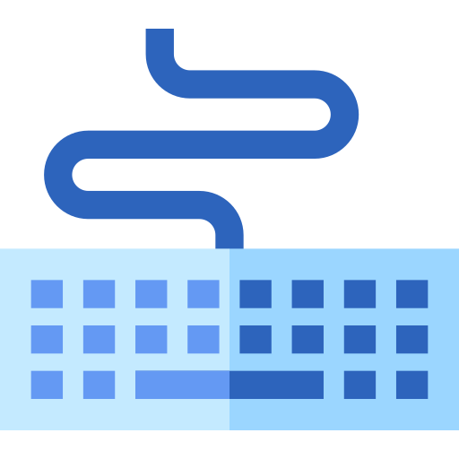

<!-- PROJECT LOGO -->
<br />
<div align="center">
  <a href="https://github.com/roywolfer/typing-game">
    
  </a>

<h3 align="center">Typing Game</h3>
  <p align="center">
    A game made with React that tests your typing speed and accuracy. 
  </p>
</div>

<!-- ABOUT THE PROJECT -->

## About The Project

[![Product Name Screen Shot][product-screenshot]]

This is a game made with React that tests your typing speed and accuracy.

You have one minute to correctly type as many given words as you can.
At the end of the game, you will see your WPM (Words Per Minute) and other statistics about your typing.
Your top 5 scores will be shown below the game.

<p align="right">(<a href="#readme-top">back to top</a>)</p>

### Built With

- [![React][React.js]][React-url]
- [![Typescript][Typescript.com]][Typescript-url]
- [![MUI][MUI.com]][MUI-url]

<p align="right">(<a href="#readme-top">back to top</a>)</p>

<!-- GETTING STARTED -->

## Getting Started

To get a local copy up and running follow these simple example steps.

### Prerequisites

Make sure you have the latest version of npm

```sh
npm install npm@latest -g
```

### Installation

1. Clone the repo
   ```sh
   git clone https://github.com/roywolfer/typing-game.git
   ```
2. Install NPM packages
   ```sh
   npm install
   ```

### Running

Run the project locally

```sh
npm run dev
```

<p align="right">(<a href="#readme-top">back to top</a>)</p>

<!-- LICENSE -->

## License

Distributed under the MIT License. See `LICENSE.txt` for more information.

<p align="right">(<a href="#readme-top">back to top</a>)</p>

<!-- CONTACT -->

## Contact

Roy Wolfer - wolfer.roy@gmail.com

Project Link: [https://github.com/roywolfer/typing-game](https://github.com/roywolfer/typing-game)

<p align="right">(<a href="#readme-top">back to top</a>)</p>

<!-- MARKDOWN LINKS & IMAGES -->
<!-- https://www.markdownguide.org/basic-syntax/#reference-style-links -->

[product-screenshot]: assets/game-screenshot.png
[React.js]: https://img.shields.io/badge/React-20232A?style=for-the-badge&logo=react&logoColor=61DAFB
[React-url]: https://reactjs.org/
[Typescript.com]: https://img.shields.io/badge/TypeScript-007ACC?style=for-the-badge&logo=typescript&logoColor=white
[Typescript.url]: https://www.typescriptlang.org/
[MUI.com]: https://img.shields.io/badge/Material--UI-0081CB?style=for-the-badge&logo=material-ui&logoColor=white
[MUI.url]: https://mui.com/
